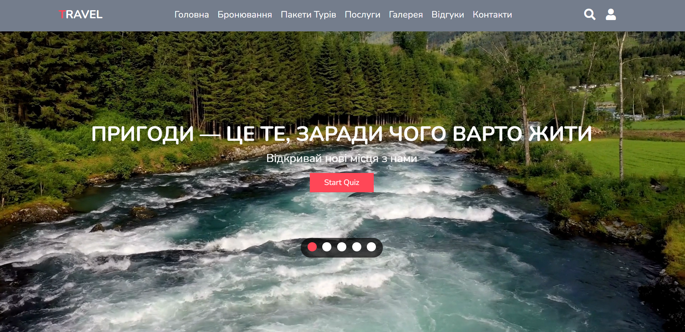

# 🌍 Find Your Dream Trip

An interactive travel assistant website to help you discover your next adventure!  
Take a quick quiz, get personalized destination recommendations, and get inspired by beautiful visuals from around the world. ✈️🌅


## 📸 Preview




## 💡 Project Idea

So many people want to travel but have no idea *where to go*.  
**Find Your Dream Trip** solves that by asking a few simple questions — and recommending a destination based on your preferences, mood, and travel style.

This project is a mix of design, logic, and a bit of wanderlust!


## 🚀 Features

- ✅ Interactive quiz based on interests and preferences  
- 🖼️ Image gallery of top travel locations  
- 🎨 Clean, vibrant, responsive design  
- 📱 Mobile and tablet friendly layout  


## 💻 Getting Started

Follow these steps to get started with the project:

1. Clone the repository:
   ```bash
   git clone https://github.com/Sofia7b/project_find_your_dream_trip.git

2. Open the project folder and edit the files using your favorite editor (e.g., Visual Studio Code).

3. Open index.html in your browser to see the project in action.


## 🛠️ Tech Stack

| Tech        | Description |
|-------------|-------------|
| **HTML5**   | Page structure and layout |
| **CSS3**    | Styling, animations, responsive design |
| **JavaScript** | Quiz logic and interactivity |
| **JSON**    | Stores destination data |
| **Git & GitHub** | Version control and deployment |


## 📁 Project Structure
```bash
your_dream_trip_project/
# Folder containing all images for the project
├── images/                     
│   ├── ... (images here)
├── js/      
# Handles quiz logic and destination  generation                   
│   ├── quiz_with_generator.js  
│   ├── quiz.js   
# General site functionality             
│   └── script.js    
# JSON file containing destination data           
├── locations.json              
├── style/         
# Styles specific to the quiz page             
│   ├── quiz.css     
# Global styles for the website           
│   └── style.css               
├── .gitignore 
 # Main entry point of the website               
├── index.html                 
├── LICENSE    
# Quiz page for users                 
├── quiz.html    
# Project documentation and instructions               
├── README.md 


📄 License
This project is licensed under the MIT License - see the LICENSE file for details.
